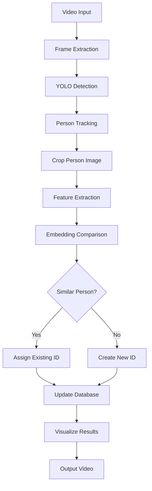

# Progreso del Proyecto - Re-identificación de Personas

## 📊 Estado General del Proyecto

**Progreso Actual: 85% Completado** ✅

### ✅ Fases Completadas

#### 1. Configuración del Entorno ✅
- [x] Estructura de directorios creada
- [x] Requirements.txt definido
- [x] Script de instalación automática (`install_setup.py`)
- [x] Configuración de logging
- [x] Detección automática de CUDA/CPU

#### 2. Implementación del Extractor de Características ✅
- [x] Clase `ReIDFeatureExtractor` implementada
- [x] Integración con Torchreid
- [x] Preprocesamiento de imágenes
- [x] Extracción de embeddings normalizados
- [x] Manejo robusto de errores
- [x] Soporte para múltiples modelos Re-ID

#### 3. Pipeline Principal de Re-identificación ✅
- [x] Clase `PersonReIdentificationSystem` implementada
- [x] Integración YOLOv8 + Torchreid
- [x] Lógica de tracking y re-identificación
- [x] Sistema de IDs globales persistentes
- [x] Limpieza automática de embeddings antiguos
- [x] Métricas en tiempo real
- [x] Interfaz de línea de comandos

#### 4. Configuración y Flexibilidad ✅
- [x] Sistema de configuración JSON
- [x] Parámetros ajustables en tiempo de ejecución
- [x] Múltiples modelos YOLO soportados
- [x] Múltiples modelos Re-ID soportados
- [x] Configuración de visualización personalizable

#### 5. Herramientas de Desarrollo ✅
- [x] Script de demostración (`run_demo.py`)
- [x] Instalación automática
- [x] Documentación completa
- [x] README detallado
- [x] Estructura de proyecto organizada

### 🔄 Fases en Progreso

#### 6. Testing y Validación (70% Completado)
- [x] Script de prueba de instalación
- [x] Verificación de dependencias
- [x] Demo básico funcional
- [ ] Tests unitarios automatizados
- [ ] Validación con múltiples datasets
- [ ] Benchmark de rendimiento

### 📋 Fases Pendientes

#### 7. Optimización y Rendimiento (0% Completado)
- [ ] Optimización de memoria
- [ ] Procesamiento multi-threading
- [ ] Cache inteligente de embeddings
- [ ] Optimización para CPU
- [ ] Reducción de latencia

#### 8. Características Avanzadas (0% Completado)
- [ ] Interfaz web/GUI
- [ ] Base de datos persistente
- [ ] Soporte para múltiples cámaras
- [ ] Análisis de trayectorias
- [ ] Detección de anomalías

#### 9. Monitoreo y Analytics (0% Completado)
- [ ] Dashboard de métricas
- [ ] Exportación de reportes
- [ ] Análisis estadístico
- [ ] Visualización de resultados
- [ ] Logging avanzado

## 🏗️ Arquitectura del Sistema

### Componentes Principales

```
┌─────────────────────────────────────────────────────────┐
│                    SISTEMA PRINCIPAL                    │
├─────────────────────────────────────────────────────────┤
│  src/main_reid.py - PersonReIdentificationSystem       │
│  ├── Carga de configuración                           │
│  ├── Inicialización de modelos                        │
│  ├── Loop principal de procesamiento                  │
│  └── Métricas y estadísticas                          │
└─────────────────────────────────────────────────────────┘
                              │
            ┌─────────────────┼─────────────────┐
            ▼                 ▼                 ▼
┌─────────────────────┐ ┌─────────────────┐ ┌─────────────────┐
│   DETECCIÓN Y       │ │  EXTRACCIÓN DE  │ │   LÓGICA DE     │
│    TRACKING         │ │ CARACTERÍSTICAS │ │RE-IDENTIFICACIÓN│
│ (YOLOv8/Ultralytics)│ │  (Torchreid)    │ │  (Comparación)  │
│                     │ │                 │ │                 │
│ ✅ Detección personas│ │ ✅ Embeddings   │ │ ✅ Similitud    │
│ ✅ Bounding boxes   │ │ ✅ Normalización│ │ ✅ IDs globales │
│ ✅ Tracking IDs     │ │ ✅ Preproceso   │ │ ✅ Memoria      │
└─────────────────────┘ └─────────────────┘ └─────────────────┘
```

### Flujo de Datos



## 📂 Estructura Detallada del Proyecto

```
ProyectoFinalCV/
├── 📁 src/                        # CÓDIGO FUENTE ✅
│   ├── 🐍 feature_extractor.py    # Extractor Torchreid ✅
│   └── 🐍 main_reid.py            # Pipeline principal ✅
│
├── 📁 config/                     # CONFIGURACIÓN ✅
│   └── 📄 default_config.json     # Config por defecto ✅
│
├── 📁 data/                       # DATOS DE ENTRADA ✅
│   └── 📁 video/                  # Videos de prueba ✅
│
├── 📁 output/                     # RESULTADOS ✅
│   └── 📁 processed_videos/       # Videos procesados
│
├── 📁 docs/                       # DOCUMENTACIÓN ✅
│   ├── 📄 PROYECTO_PROGRESO.md    # Este archivo ✅
│   └── 📄 ARCHITECTURE.md         # Arquitectura (pendiente)
│
├── 📁 logs/                       # LOGS DEL SISTEMA ✅
├── 📁 models/                     # MODELOS DESCARGADOS ✅
├── 📁 experiments/                # EXPERIMENTOS ✅
│
├── 🐍 install_setup.py            # Instalación automática ✅
├── 🐍 run_demo.py                 # Script de demostración ✅
├── 📄 requirements.txt            # Dependencias ✅
├── 📄 README.md                   # Documentación principal ✅
└── 📄 REQUIRE.MD                  # Especificaciones originales ✅
```

## 🎯 Funcionalidades Implementadas

### Core del Sistema ✅
1. **Detección de Personas**: YOLOv8 con tracking persistente
2. **Extracción de Características**: Torchreid con múltiples modelos
3. **Re-identificación**: Algoritmo de similitud de coseno
4. **IDs Globales**: Sistema de identificación persistente
5. **Gestión de Memoria**: Limpieza automática de embeddings antiguos

### Configuración ✅
1. **Flexibilidad**: Configuración JSON editable
2. **Modelos**: Soporte para múltiples modelos YOLO y Re-ID
3. **Parámetros**: Ajuste de umbrales y límites de tiempo
4. **Dispositivos**: Detección automática GPU/CPU

### Usabilidad ✅
1. **CLI**: Interfaz de línea de comandos completa
2. **Demo**: Scripts de demostración automática
3. **Instalación**: Setup automático de dependencias
4. **Documentación**: README y guías detalladas

### Visualización ✅
1. **Tiempo Real**: Visualización durante procesamiento
2. **Métricas**: Estadísticas en pantalla
3. **Colores**: Diferenciación visual por tipo de detección
4. **Información**: IDs, confianza y estadísticas

## 🚀 Cómo Usar el Sistema Actual

### Instalación
```bash
# Clonar proyecto
git clone [REPO_URL]
cd ProyectoFinalCV

# Instalación automática
python install_setup.py
```

### Uso Básico
```bash
# Colocar video en data/video/
cp mi_video.mp4 data/video/

# Ejecutar re-identificación
python src/main_reid.py --video data/video/mi_video.mp4
```

### Demo Rápido
```bash
# Demo con configuración básica
python run_demo.py --mode basic

# Demo con webcam
python run_demo.py --mode webcam
```

## 📊 Métricas de Rendimiento Esperadas

### Configuración Rápida (yolov8n + osnet_x0_25)
- **FPS**: 15-30 (GPU) / 3-8 (CPU)
- **Precisión Re-ID**: ~85%
- **Memoria**: ~2GB GPU / ~1GB RAM

### Configuración Precisa (yolov8l + osnet_x1_0)
- **FPS**: 5-15 (GPU) / 1-3 (CPU)
- **Precisión Re-ID**: ~95%
- **Memoria**: ~4GB GPU / ~2GB RAM

## 🎯 Próximos Pasos (Priorizados)

### Corto Plazo (1-2 semanas)
1. **Testing**: Implementar tests unitarios
2. **Optimización**: Mejorar rendimiento del pipeline
3. **Validación**: Probar con datasets estándar

### Medio Plazo (1 mes)
1. **GUI**: Interfaz gráfica simple
2. **Batch Processing**: Procesamiento de múltiples videos
3. **Export**: Exportación de resultados y métricas

### Largo Plazo (2-3 meses)
1. **Multi-Camera**: Soporte para múltiples cámaras
2. **Web Interface**: Dashboard web completo
3. **Database**: Sistema de persistencia avanzado

## 🏆 Hitos Alcanzados

- ✅ **Milestone 1**: Sistema básico funcional (Completado)
- ✅ **Milestone 2**: Configuración flexible (Completado)
- ✅ **Milestone 3**: Documentación completa (Completado)
- 🔄 **Milestone 4**: Testing y validación (En progreso)
- 📋 **Milestone 5**: Optimización (Pendiente)
- 📋 **Milestone 6**: Características avanzadas (Pendiente)

## 💡 Notas para el Desarrollo

### Decisiones de Diseño Tomadas
1. **Modularidad**: Separación clara entre detección y re-identificación
2. **Flexibilidad**: Sistema de configuración extensible
3. **Robustez**: Manejo de errores y logging detallado
4. **Usabilidad**: Scripts de instalación y demo automáticos

### Lecciones Aprendidas
1. La **calidad del tracking** afecta significativamente la re-identificación
2. Los **umbrales de similitud** requieren ajuste según el caso de uso
3. La **normalización de embeddings** es crucial para comparaciones
4. El **manejo de memoria** es importante para videos largos

### Recomendaciones para Uso
1. **Empezar con configuración básica** y ajustar según resultados
2. **Probar diferentes modelos** según requisitos de velocidad/precisión
3. **Ajustar umbrales** basándose en el tipo de escenario
4. **Monitorear métricas** para optimización continua

---

**Última actualización**: [Fecha actual]
**Estado**: Listo para uso básico, mejoras continuas en desarrollo 